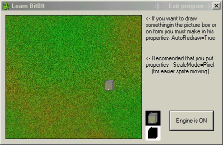



## Learn BitBlt \- Step 1

### Description

With this little tutorial you will learn how to draw an object using BitBlt, in one day!

Code well commented..
 
### More Info
 

             |
---                |---
**Submitted On**   |2003-05-10 01:09:26
**By**             |[Edi Budimilic](https://github.com/Planet-Source-Code/PSCIndex/blob/master/ByAuthor/edi-budimilic.md)
**Level**          |Beginner
**User Rating**    |5.0 (15 globes from 3 users)
**Compatibility**  |VB 5\.0, VB 6\.0
**Category**       |[Graphics](https://github.com/Planet-Source-Code/PSCIndex/blob/master/ByCategory/graphics__1-46.md)
**World**          |[Visual Basic](https://github.com/Planet-Source-Code/PSCIndex/blob/master/ByWorld/visual-basic.md)
**Archive File**   |[Learn\_BitB1585815102003\.zip](https://github.com/Planet-Source-Code/edi-budimilic-learn-bitblt-step-1__1-45385/archive/master.zip)

